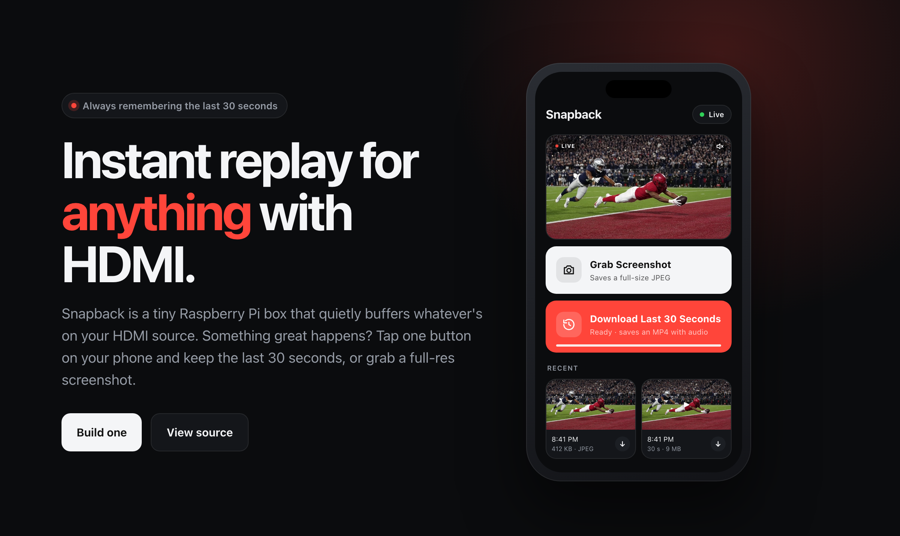
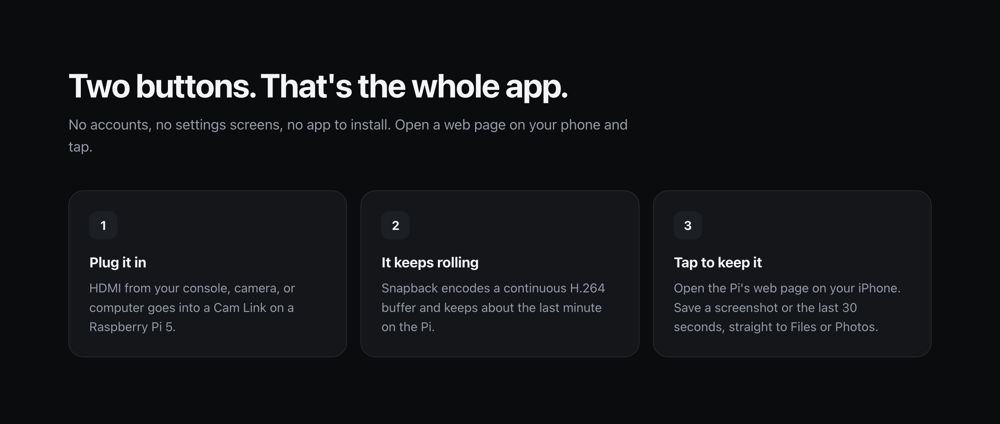
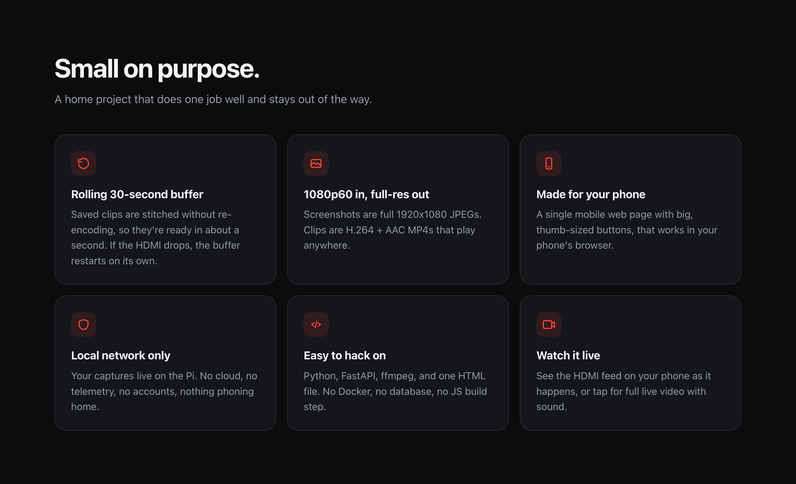
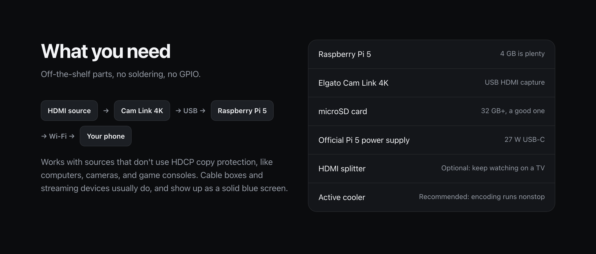

# Snapback

**Instant replay for anything with HDMI.** Website: [snapback.video](https://www.snapback.video/) · Contact: [contact@snapback.video](mailto:contact@snapback.video)

[](https://www.snapback.video/)

Snapback turns a Raspberry Pi 5 with an Elgato Cam Link 4K into a tiny HDMI capture box for the home network. Open it in your phone's browser and there are two buttons:

1. **Grab Screenshot**: saves a 1920x1080 JPEG of the live HDMI input.
2. **Download Last 30 Seconds**: saves the previous ~30 seconds (H.264 + AAC MP4).

Above them is a live view of the HDMI input: a near-real-time preview, or tap for live video with sound (a few seconds behind).

No accounts, cloud, telemetry, database, Docker, or JS build tooling. Python + FastAPI + ffmpeg + one HTML file.





> **Disclaimer:** Snapback is a personal home project provided **as-is, without warranty of any kind**. The authors are not liable for lost recordings, data loss, hardware damage, or anything else arising from its use. You are responsible for what you capture, including copyright, terms of service, and recording/consent laws. It has no login, so run it only on a trusted network and never expose it to the internet. Not affiliated with Raspberry Pi, Elgato, or Apple. Read the full [DISCLAIMER.md](DISCLAIMER.md).

## Hardware



- Raspberry Pi 5 (4 GB is plenty) with an active cooler
- Elgato Cam Link 4K
- A good 32 GB+ microSD card and the official 27 W USB-C power supply
- Optional: an HDMI splitter so you can keep watching on a TV

**Copy-protected sources show a solid blue screen.** Cable and satellite boxes, streaming sticks, and Blu-ray players usually encrypt their HDMI output with HDCP. Your TV can decrypt it; capture cards like the Cam Link can't, so Snapback only sees blue. This is expected and can't be fixed in software. Snapback works with sources that don't use HDCP, such as computers, cameras, and game consoles (on PlayStation, turn off "Enable HDCP" in the system settings).

## Install

On Raspberry Pi OS with `ffmpeg` and Python 3 installed:

```sh
git clone https://github.com/dconroy/snapback.git ~/snapback
cd ~/snapback
python3 -m venv .venv
.venv/bin/pip install -r requirements.txt
.venv/bin/python -m snapback serve
```

Then open `http://<your-pi>.local:8080/` on your phone. The rolling buffer starts with the app, so give it ~30 seconds before the first replay has full length.

To run it as a service or start it at boot, see [docs/pi-startup.md](docs/pi-startup.md).

## Configuration

Environment variables, all optional. If you run Snapback as a service, put them in `~/snapback-runtime/snapback.env` (`KEY=value` lines) and restart it.

| Variable | Default |
| --- | --- |
| `SNAPBACK_RUNTIME_DIR` | `~/snapback-runtime` |
| `SNAPBACK_MEDIA_DIR` | `$SNAPBACK_RUNTIME_DIR/captures` |
| `SNAPBACK_BUFFER_DIR` | `$SNAPBACK_RUNTIME_DIR/buffer` |
| `SNAPBACK_VIDEO_DEVICE` | `/dev/video0` |
| `SNAPBACK_AUDIO_DEVICE` | `hw:CARD=C4K,DEV=0` |
| `SNAPBACK_X264_PRESET` | `ultrafast` |
| `SNAPBACK_START_BUFFER` | `1` (set `0` to not start the buffer, e.g. for UI work) |

## HTTP API

- `GET /`: the web page.
- `GET /api/status`: device detected, buffer state, buffered seconds, latest screenshot/replay, free disk, last error.
- `POST /api/screenshot`: saves a JPEG and returns `{filename, url, size_bytes, ...}`.
- `POST /api/replay`: saves the last ~30 s and returns `{filename, url, approx_seconds, ...}`.
- `GET /media/{filename}`: serves a file from the media directory only (strict filename check, no subpaths).
- `GET /live/frame.jpg`: the buffer's newest frame (refreshed twice a second), for the live preview.
- `GET /live/stream.m3u8`: an HLS live playlist over the newest buffer segments, for live video with sound in browsers that play HLS natively, such as Safari (elsewhere the page hides the live-video toggle and keeps the frame preview). Segments are served from `/live/seg_NNNNNN.ts`.

Errors are JSON `{"detail": "..."}`: `409` if the capture device is busy, `503` if capture failed or the buffer has no footage.

## Development

```sh
uv venv --python 3.13 .venv          # or: python3 -m venv .venv
uv pip install --python .venv/bin/python -r requirements-dev.txt
.venv/bin/python -m pytest -q
SNAPBACK_START_BUFFER=0 .venv/bin/python -m snapback serve --port 8080   # UI without hardware
```

Unit tests mock ffmpeg and need no hardware. Hardware checks are in [docs/manual-verification.md](docs/manual-verification.md).

## Docs

- [docs/web-app.md](docs/web-app.md): how the app, rolling buffer, and device ownership work.
- [docs/capture-engine.md](docs/capture-engine.md): `CaptureEngine` and CLI utilities.
- [docs/manual-verification.md](docs/manual-verification.md): on-Pi verification checklist.
- [docs/pi-startup.md](docs/pi-startup.md): running as a systemd service and starting at boot.
